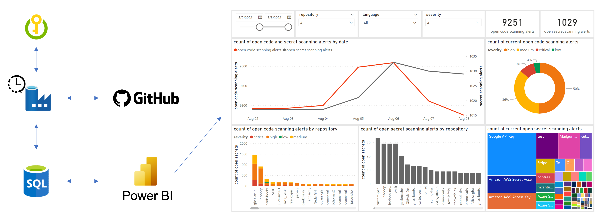

# ghas-charts 🔥
While GitHub supports integrations with [Power BI](https://docs.microsoft.com/en-us/power-bi/connect-data/service-connect-to-github#whats-included-in-the-app) and [Splunk](https://github.com/splunk/github_app_for_splunk), `ghas-charts` hopes to offer an approach that enables direct interaction with the GitHub REST API, as well as a means to store historical (GitHub Advanced Security-related) data. Additionally `ghas-charts` can be used as a portable means to collect and visualize data when a customer is conducting a PoC of GHAS (i.e., immediate, demonstrable improvement in security posture 📉).

To find out more about the native out-of-box experience with GitHub Advanced Security on GitHub, see the [Security Overview](https://github.blog/changelog/2022-04-07-security-overview-for-organizations-is-generally-available/) announcement. 

# Overview 
The general approach is:
- **Azure Data** Factory interacts with **Azure Key Vault** to obtain a token for use with the **GitHub REST API**. 
- On a scheduled trigger (e.g., daily) code scanning alerts, secret scanning alerts, and repository data is extracted from the REST API at that point in time via Azure Data Factory's integration runtime. 
- The respective data is loaded into an **Azure SQL Database**, which is in turn viewed as a data source within **Power BI**.

:microsoft-intensifies:

Without too much effort, historical and current-state charts can be created to drive analysis and remediation effort prioritization. 



# Azure Key Vault
Azure Key Vault (AKV) is the (only❓) way that Azure Data Factory supports specifying secure strings (a.k.a secrets) dynamically within Linked Services. The AKV is generally only accessed by the managed identity of the Azure Data Factory, and only stores the GitHub PAT that is used to interact with the GitHub REST API.  
## GitHub PAT
The GitHub Personal Access Token (PAT) requires the following Read level permissions at the repository to successfully call the required REST API endpoints:

- Code (to parse files in `.github/workflows` for GitHub Actions analysis)
- Dependabot Alerts
- Metadata
- Secret Scanning Alerts
- Security Events
## Access Policy
By default, owners of AKV resources are able to set Access Policies on a given AKV, implying that owners are also able to Get and List secrets. However, the Azure Data Factory (Managed Identity) must also be allowed to Get and List secrets. Once the Azure Data Factory is created, apply an access policy that allows it to get and list secrets on the AKV.

# Azure SQL Server / Database
## Azure Active Directory Admin
To enable initial configuration of contained database users, as well as creating tables, the Azure Active Directory Admin should be set on the Azure SQL Server that hosts the Azure SQL Database. 
## Contained Database User
A contained database user must be created for the Azure Data Factory so that it is able to write data to the Azure SQL Database tables. 

```SQL
CREATE USER [name-of-azure-data-factory] FROM EXTERNAL PROVIDER
```

Is also needs to be assigned the `db_datawriter` role.

```SQL
ALTER ROLE db_datawriter ADD [name-of-azure-data-factory]
```

## Tables
The following tables must be created on the Azure SQL Database. They store the historical data extracts, respectively. 
### Repositories
```SQL
CREATE TABLE [dbo].[repositories](
	[archived] [bit] NULL,
	[created_at] [nvarchar](20) NULL,
	[default_branch] [nvarchar](1000) NULL,
	[full_name] [nvarchar](1000) NULL,
	[id] [int] NULL,
	[language] [nvarchar](100) NULL,
	[languages_url] [nvarchar](1000) NULL,
	[name] [nvarchar](1000) NULL,
	[pushed_at] [nvarchar](20) NULL,
	[size] [int] NULL,
	[topics] [nvarchar](1000) NULL,
	[updated_at] [nvarchar](20) NULL,
	[date] [date] NULL,
	[unique_id] [nvarchar](4000) NULL
) ON [PRIMARY]
```
### Code Scanning Alerts
```SQL
CREATE TABLE [dbo].[code_scanning_alerts](
	[created_at] [nvarchar](20) NULL,
	[dismissed_at] [nvarchar](20) NULL,
	[dismissed_by] [nvarchar](4000) NULL,
	[dismissed_reason] [nvarchar](20) NULL,
	[fixed_at] [nvarchar](20) NULL,
	[number] [int] NULL,
	[repo_full_name] [nvarchar](4000) NULL,
	[repo_id] [int] NULL,
	[rule_id] [nvarchar](4000) NULL,
	[rule_name] [nvarchar](4000) NULL,
	[security_severity_level] [nvarchar](30) NULL,
	[state] [nvarchar](30) NULL,
	[tool_name] [nvarchar](4000) NULL,
	[updated_at] [nvarchar](20) NULL,
	[date] [date] NULL,
	[unique_id] [nvarchar](4000) NULL
) ON [PRIMARY]
```
### Secret Scanning Alerts
```SQL
CREATE TABLE [dbo].[secret_scanning_alerts](
	[created_at] [nvarchar](20) NULL,
	[number] [int] NULL,
	[push_protection_bypassed] [bit] NULL,
	[push_protection_bypassed_login] [nvarchar](4000) NULL,
	[repo_full_name] [nvarchar](4000) NULL,
	[resolution] [nvarchar](4000) NULL,
	[resolved_by_login] [nvarchar](4000) NULL,
	[resolved_at] [nvarchar](20) NULL,
	[secret_type_display_name] [nvarchar](100) NULL,
	[state] [nvarchar](30) NULL,
	[updated_at] [nvarchar](20) NULL,
	[date] [date] NULL,
	[unique_id] [nvarchar](4000) NULL
) ON [PRIMARY]
```

# Azure Data Factory
Azure Data Factory (ADF) is the core orchestration platform that extracts data from the GitHub REST API, as well as inserts it into the appropriate table on the Azure SQL Database. 
## Linked Services
Linked Services are created for the below
- Azure Key Vault
  - Ensure that Access Policy that allows the Azure Data Factory to Get and List secrets is configured on the Azure Key Vault
- GitHub REST API v3
  - Limit the scope of the url to https://api.github.com so that relative URLs can be used in REST datasets
  - Ensure the _Authourization_ header specifies the PAT that is stored in the Azure Key Vault Linked Service 
- Azure SQL Database
  - Authenticate using the Managed Identity for the Azure Data Factory; ensure the needed contained database user is created 
## Datasets
- REST API
  - Repositories
  - Code Scanning Alerts
  - Secret Scanning Alerts
- SQL 
  - Repositorie
  - Code Scanning Alerts
  - Secret Scanning Alerts
## Data flows
- Repositories
- Code Scanning Alerts
- Secret Scanning Alerts
## Pipelines
- ghas-data
## Triggers
- Daily execution

# Power BI
To view a live demonstration of `ghas-charts`, [click here](https://app.powerbi.com/links/uJfbfJg3f8?ctid=398a6654-997b-47e9-b12b-9515b896b4de&pbi_source=linkShare) and login with your @githubazure.com credentials (i.e., _your handle_@githubazure.com). Currently, the [OctoDemo](https://github.com/octodemo) organization is targeted, and only alerts with a `security_severity_level` are considered. 

## Data Sources
It is straight forward to add the Azure SQL Database as a data source in Power BI. As a basic case, the Azure Active Directory Admin of the Azure SQL Server will be able to use their Microsoft identity to connect (other contained database users can be added, and assigned the `db_datareader` role, as well). Note that a _temporary_ Azure SQL Server Firewall rule would need to be added for the host that is attempting to connect via Power BI Desktop. 

The result of adding the Azure SQL Database as a data source is that `repositories`, `code_scanning_alerts`, and `secret_scanning_alerts` (the tables in the database) are part of the model.

## Date Table
The `ghas-charts` approach assumes that daily executions of the Azure Data Factory pipeline occur. Because of this, a date table in Power BI is created based on the earliest date of data extraction. Below is the DAX to create the Date table in the model.

```
date = CALENDAR(MIN(repositories[date]),TODAY())
```

## Relationships
- `repositories[unique_id]` 1 &rarr; * `secret_scanning_alerts[unique_id]`
- `repositories[unique_id]` 1 &rarr; * `code_scanning_alerts[unique_id]`
- `date[date]` 1 &rarr; * `repositories[date]`

# Considerations
## GitHub.com vs Enterprise Server
## Multiple GitHub Organizations
## Azure SQL Database vs Synapse
## Azure SQL Server / Synapse Security
## Direct Query vs Import
## Metrics and Targets
## ARM Templates